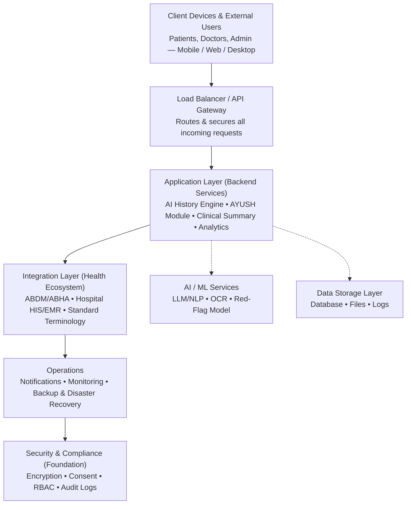

# System Architecture — Components

## High-Level Flow

Request flow: client devices hit the API gateway, which forwards work to the application layer. The application layer leans on AI/ML services and the data storage layer as it processes each request, then hands off to the integration layer to sync with the broader health ecosystem. Operations (notifications, monitoring, backup) run alongside every stage, and security & compliance underpins the entire stack.

## Components

## Frontend
Handles patient/doctor interaction across mobile, tablet, web, and desktop — collects voice, touch, text, and document input, and displays results in the patient's chosen language.

## API Gateway / Load Balancer
Receives all incoming requests from web and mobile clients, routes them to the right backend service, and distributes load across instances.

## Backend API (Application Layer)
Validates input, coordinates the intake workflow, and orchestrates the AI History Engine, Document Intelligence, AYUSH Module, and Clinical Summary logic.

## Machine Learning Services
Processes patient input to generate predictions and insights — includes the LLM/NLP model, OCR engine, red-flag detection model, and recommendation engine.

## Database (Data Storage Layer)
Stores application data such as patient profiles, medical history, uploaded documents, and prediction/analysis logs.

## Integration Layer
Connects the system to external health infrastructure — ABDM/ABHA, hospital HIS/EMR, and standardized medical terminology services.

## Authentication & User Management
Verifies identity and controls what each user (patient, doctor, admin) is allowed to access.

## Security & Compliance
Encrypts data, manages consent, enforces role-based access, and logs activity for regulatory compliance.
